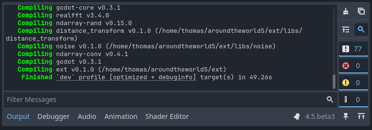

Godot Rust Tools 
================

Godot Rust Tools, or "Rust Tools" for short, is a simple and lightweight addon for [Godot](https://godotengine.org/) 4 to help during development of Godot games that use Rust extensions through GDExtension:

- Automatic `cargo build` when you run the project.
- A "Build" button in the toolbar to invoke `cargo build` manually.
- A checkbox "Rust Backtrace" that sets `RUST_BACKTRACE=1` in the environment.

[godot-rust](https://godot-rust.github.io/) is the canonical library for Rust bindings, but this plugin is not dependent on it and can work just as well with custom bindings.

Installation
------------

Download this addon's project files from GitHub. Copy the `addons/rust_tools` folder to the `addons` folder in your own Godot project, creating it if necessary. Files outside `addons/rust_tools` are not needed to use the addon.

Building Rust code
------------------

Cargo projects are detected automatically: Rust Tools scans the root directory of the project for any directories containing `Cargo.toml`.

All output from the compiler is shown afterwards in the Output pane, properly colourized:

Whenever you run the project or the current scene, `cargo build` is invoked automatically. Due to limitations of the Godot plugin API, the build is invoked on the main thread, and will freeze the UI until it's done.

Backtrace toggle
----------------

Due to limitations in the Rust standard library, the "Rust Backtrace" checkbox only takes effect on newly started processes. You cannot use it to enable backtraces on a currently running game.

License
-------

MIT, like Godot itself. See [LICENSE.md](LICENSE.md).
