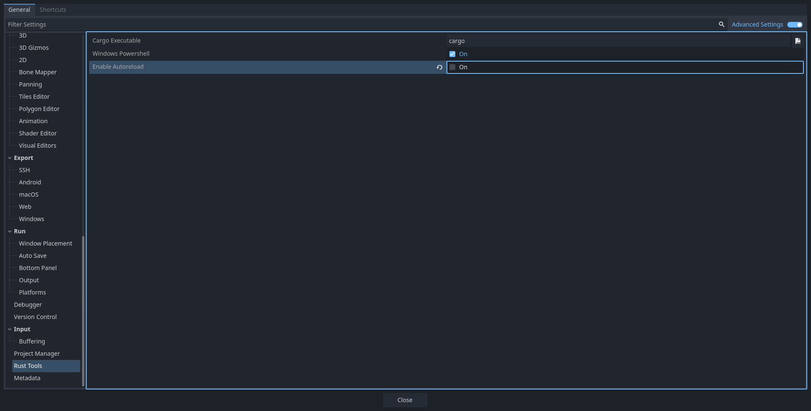
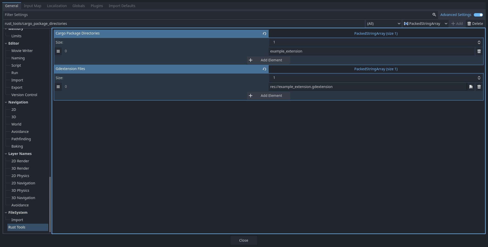

Godot Rust Tools 
================

Godot Rust Tools, or "Rust Tools" for short, is a plugin for [Godot](https://godotengine.org/) 4 to help with development of [extensions](https://docs.godotengine.org/en/stable/tutorials/scripting/gdextension/what_is_gdextension.html) written in [Rust](https://www.rust-lang.org/).

[gdext](https://godot-rust.github.io/) is the canonical and recommended library for using GDExtension from Rust, but this plugin does not depend on it and can work just as well with custom bindings.

Installation
------------

Download this plugin's project files from GitHub. Copy the `addons/rust_tools` folder to the `addons` folder in your own Godot project, creating it if necessary. Files outside `addons/rust_tools` are not needed to use the plugin.

Usage
-----

After enabling the plugin, you'll see some new toolbar buttons to the left of the usual ones, marked with a little `rs` icon:

From left to right:

- Rust Backtrace: toggle `RUST_BACKTRACE=1` in the environment of the running project, for more detailed panic reporting. Note that this only takes effect on newly started projects, not on currently running ones.
- Clean: runs `cargo clean`.
- Build: runs `cargo build`.

Build output goes to the Output pane at the bottom:

`cargo build` is also invoked automatically when you run or export your project, so you'll never get out-of-date code. However, due to limitations in the Godot API, these invocations must run synchronously, blocking the editor UI.

Configuration
-------------

## Editor Settings

### Path to `cargo` executable

If you don't have `cargo` in your `PATH`, you need to tell the editor where to find it. Go to Editor > Editor Settings… > Rust Tools, and set `Cargo Executable` to the absolute path to the `cargo` or `cargo.exe` executable.

The default, plain `cargo`, is fine if its containing directory is on your `PATH`.

### Enable/disable autoreload

If you don't want to autoreload the extensions when building or playing, you can disable it (it's enabled by default). Go to Editor > Editor Settings… > Rust Tools, and set `Enable Autoreload` to false through the checkbox.

## Project Settings

### Path to your Rust project(s)

You need to tell Rust Tools which cargo package(s) to build. You can do that under Project > Project Settings… > Rust Tools by adding their path(s) to the `Cargo Package Directories` setting:

Note that this path is relative to the Godot project itself. If your Rust code is in a subdirectory, specify its name here. If it's in a sibling directory, use something like "../rust".

### GDExtension files' paths

You need to tell Rust Tools which GDExtension(s) to reload, as to not reload all of them meaninglessly on build. You can do that under Project > Project Settings… > Rust Tools by adding the path(s) to their gdextension file(s) to the `Gdextension Files` setting:

License
-------

MIT, like Godot itself. See [LICENSE.md](LICENSE.md).
